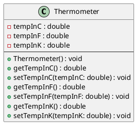

# Thermometer UML

```plantuml
@startuml
class Thermometer {
  - tempInC : double
  - tempInF : double
  - tempInK : double
  --
  + Thermometer() : void
  + getTempInC() : double
  + setTempInC(tempInC: double) : void
  + getTempInF() : double
  + setTempInF(tempInF: double) : void
  + getTempInK() : double
  + setTempInK(tempInK: double) : void
}
@enduml
```